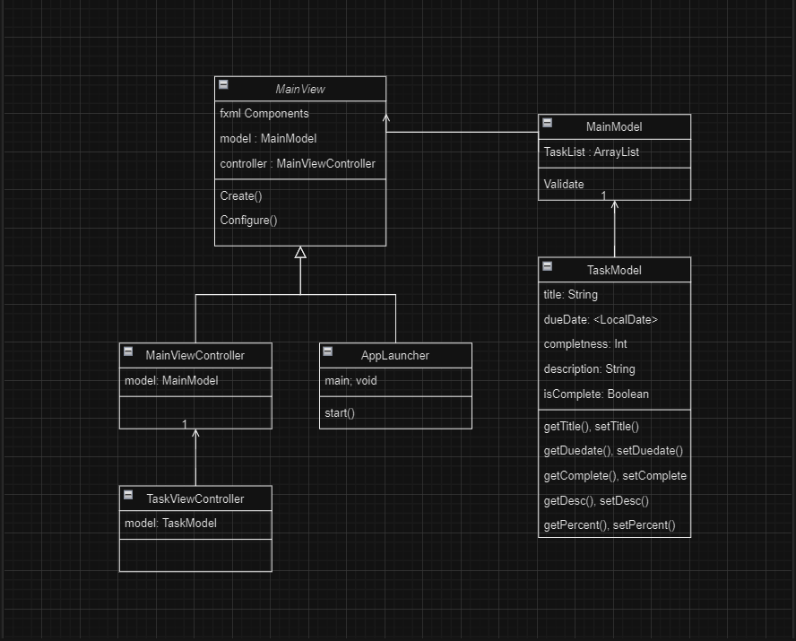

# ActivityTracker_MajorProject
This software will help you to organize and visualize any and all added tasks to help keep track of your priorities.

## Who are the users of the software?
Anyone seeking to organize their tasks efficiently, including individuals, teams, and organizations.
## What is the purpose of the software?
The software aims to streamline task management by providing a user-friendly platform to create, organize, prioritize, and track tasks and to-do lists.
## Where and when will the software be used?
It can be used anywhere with across various devices such as desktops, laptops, smartphones, and tablets. It's designed for both personal and professional use, adaptable to different environments and schedules.
## How does the software work?
Users input tasks, set deadlines, track completion percentage to categorize their tasks into different lists. It provides an intuitive interface for easy navigation and customization according to user needs and schedule loads.
## Why would anyone want to use the software over existing processes?
Unlike traditional pen-and-paper methods or scattered digital notes, this software centralizes all tasks in one accessible location. Its automation features save time and reduce the likelihood of missing deadlines. Overall, it offers a more organized and efficient approach to task management compared to existing methods.
# UML Diagram

# Part 2 Walktrhough
For Part 2:

Stack Usage: A stack was utilized to implement a "undo" feature, allowing users to revert the most recent action performed on a task.

Linked List Usage: A linked list was employed to manage the sequence of tasks within each to-do list, facilitating efficient insertion, deletion, and traversal operations.

# Part 3 Walkthrough
For Part 3:

BST Usage: A binary search tree (BST) was employed to enable quick searching for specific tasks based on their priority or due date, optimizing task retrieval operations.

Weighted Graph Usage: A weighted graph was utilized to traverse through interconnected tasks, considering factors like task dependencies or priority levels, to efficiently schedule and manage tasks within the to-do list program.
